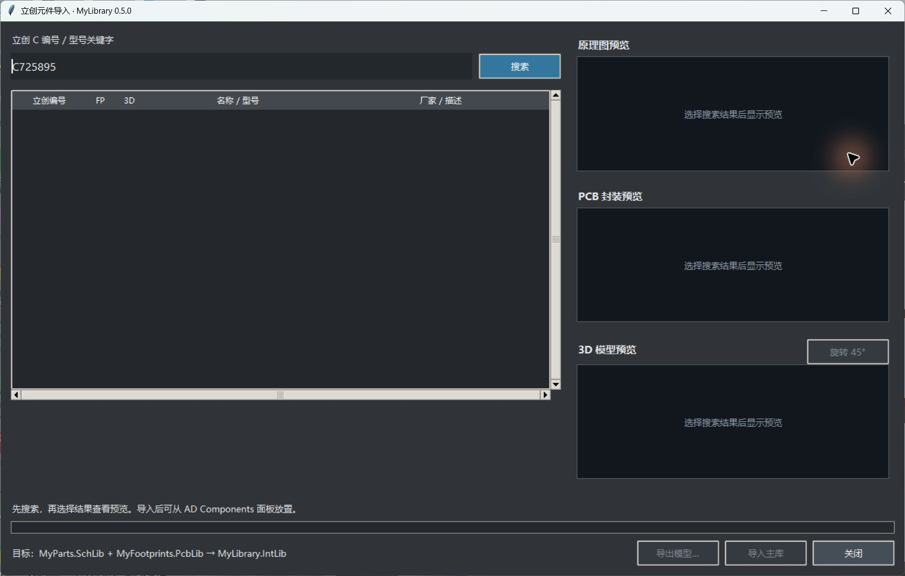

# LCSC-AD-Bridge · 立创元件导入 AD

面向 **Windows x64 / Altium Designer 2024** 的元件导入工具。通过立创 C 编号或型号搜索，将原理图符号导入 `MyParts.SchLib`，PCB 封装及嵌入 STEP 导入 `MyFootprints.PcbLib`，建立默认封装及逐引脚映射，再由 AD 原生编译为 `MyLibrary.IntLib`，在 Components 面板放置使用。

当前发布版本：**0.5.1 通用导入修复版**。恢复来源符号的多单元归属，检查 STEP 内容与模型 ID，隔离共享模型的修复，并支持手动替换 STEP。安装介质为**空库**：0 个符号、0 个封装、0 个嵌入模型，首次导入后生成集成库。0.5.1 的自动化和多器件回归已验证，AD 原生编译与放置仍需验收。

## 下载与安装

**[前往 Releases 下载安装包](https://github.com/jasenhong668-cyber/LCSC-AD-Bridge/releases)**。下载名称含 `Windows_x64_EmptyLibrary.zip` 的附件及其 SHA256 文件。GitHub 的 Source code / Code → Download ZIP 是开发源码，不能直接作为安装包使用。

1. 在目标电脑启动一次 AD 2024，然后保存文件并完全退出 AD。
2. 完整解压安装 ZIP，运行 `LCSC_AD_Setup.exe`，无需另装 Python。
3. 选择插件目录、主库目录和当前用户实际使用的 AD 2024 设置。首次安装选择空目录。
4. 点击“安装 / 修复配置”，等待成功提示后启动 AD。
5. 打开原理图、PCB 或库编辑器，点击顶部“立创元件”。
6. 搜索元件、检查预览、点击“导入主库”。等待 AD 保存、编译及封装检查成功，再从 Components → `MyLibrary.IntLib` 放置。

## 功能

- 按 C 编号或型号关键词搜索，显示原理图、PCB 和 3D 预览。
- 符号与封装写入两份主源库，STEP 嵌入封装，默认封装及引脚/焊盘映射随元件保存。
- 根据来源坐标、缩放、旋转与偏移转换模型；不按个别器件编号硬编码偏移。
- 导入前备份、重复导入去重、阶段进度、错误和超时提示。
- AD 原生保存、编译与默认封装核查，使用同一个 Components 集成库。
- 安装器生成本机路径并添加顶部入口，支持修复配置及中文路径编码检查。

| 文件 | 用途 |
| --- | --- |
| `MyParts.SchLib` | 原理图符号、参数、默认封装绑定及引脚映射 |
| `MyFootprints.PcbLib` | PCB 封装、焊盘及嵌入 STEP |
| `MyLibrary.LibPkg` | 两份源库的集成库工程 |
| `Compiled/MyLibrary.IntLib` | AD 编译后的 Components 可放置库；安装包不预置 |

## 使用资料

- **[完整安装、使用与迁移说明](installation-docs/安装与使用说明.md)**：安装目录、AD 设置选择、搜索、导入、放置和已有库处理。
- **[故障排查与恢复](installation-docs/故障与恢复.md)**：按钮不显示、启动器缺失、下载失败、编译失败、恢复备份。
- **[卸载说明](docs/UNINSTALL.md)**：移除入口与程序，保留自己的元件库。
- **[开发与构建](docs/DEVELOPMENT.md)**：依赖、源代码模块、构建方法和测试数据说明。
- **[验证范围](docs/VERIFICATION.md)**、[版本变更](CHANGELOG.md)、[第三方组件与许可](NOTICE.md)。

## 使用边界

新元件检索和下载需要联网，上游接口变化可能影响可用性。当前完整导入流程要求有效的符号、封装及 STEP；缺少模型会给出错误。进度表示处理阶段，预览就绪不等于 AD 编译完成。已放置元件需通过 AD 更新库与 PCB 流程才能同步变化。

元件尺寸与电气定义继承来源，尚未逐颗对照厂家数据手册复核。请在用于制造前核对引脚、焊盘、尺寸与方向。发布包包含采用 **CC BY-NC 4.0** 的第三方转换后端；请阅读 [NOTICE.md](NOTICE.md)，商业使用需遵守对应授权条件。本项目不附带 Altium Designer 软件或授权。
